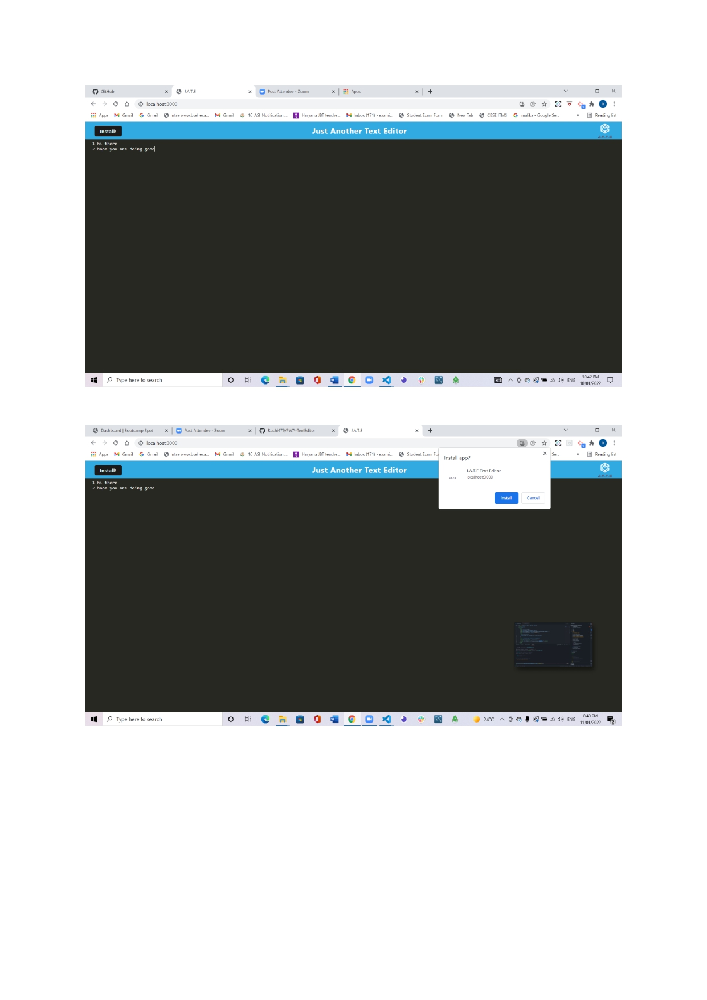
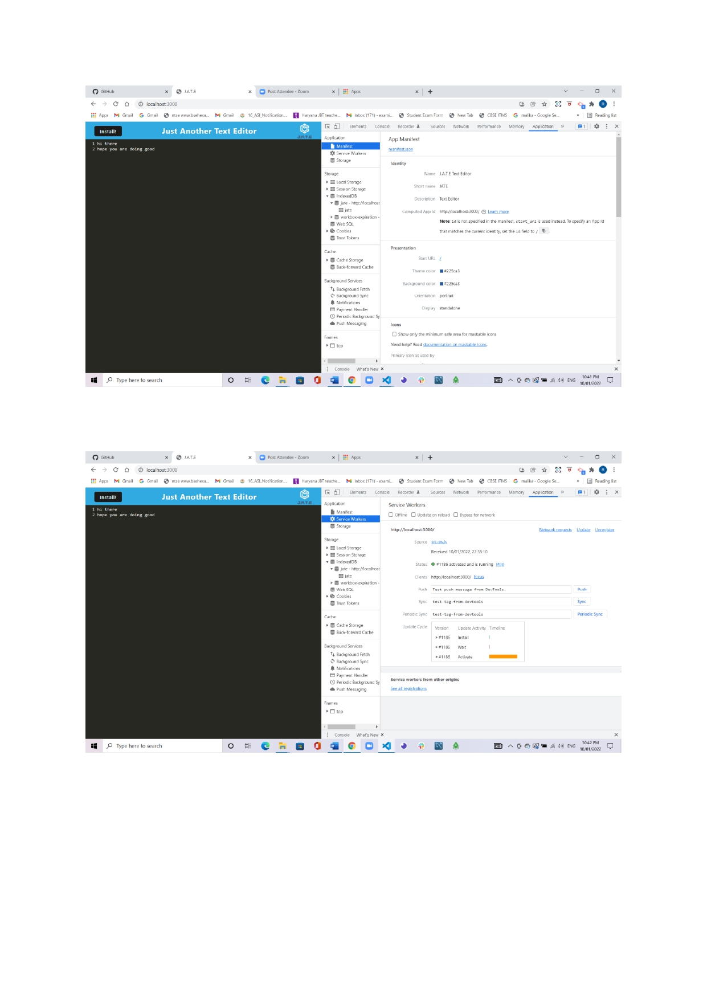
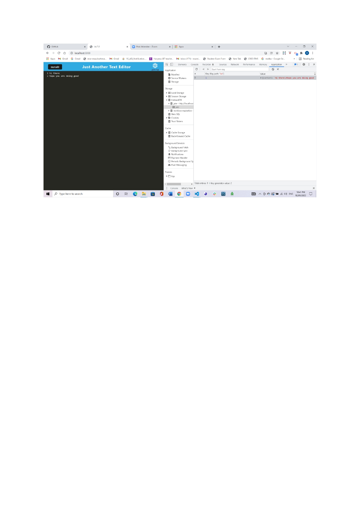

# NoSQL: Social Network API

## Table of Contents 

- [Description](#description)
- [Installation](#installation)
- [Usage](#usage)
- [Links](#links)
- [Screenshots](#screenshots)
- [Questions](#questions)

## Description
This is a single-page application that meets the PWA criteria. Additionally, it will feature a number of data persistence techniques that serve as redundancy in case one of the options is not supported by the browser. The application will also function offline.


## Installation

```
Use npm i to install dependencies
```

## Usage

```
Dependencies/Packages
Node.js
Express.js
Babel
Webpack
nodemon

IndexedDB to create an object store and includes both GET and PUT methods
service worker with workbox that Caches static assets
```

## Links
* [The URL of the GitHub repository](https://github.com/Ruchi479/PWA-TextEditor.git)

* [The URL of application deployed on heroku](https://arcane-shore-34131.herokuapp.com/)


## Screenshots





## Questions?

If you have any questions about the project, contact us at: https://github.com/Ruchi479

